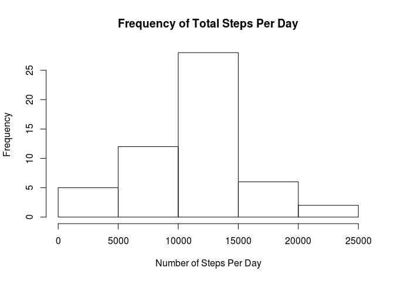
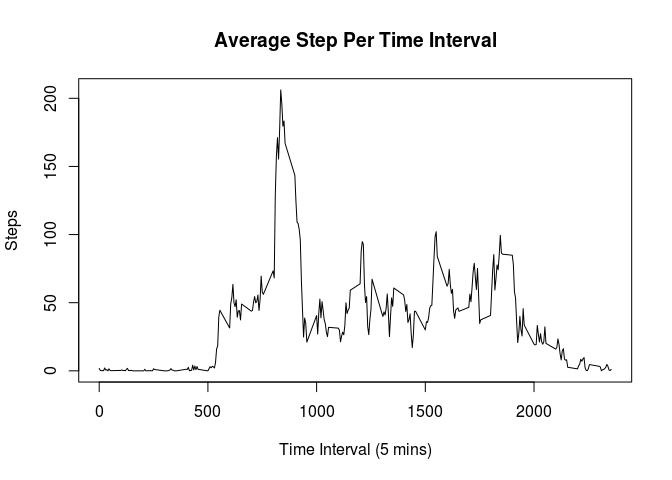
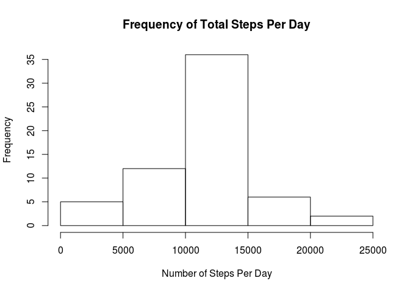

# Reproducible Research: Peer Assessment 1


## Loading and preprocessing the data
To load the dataset, under the assumption that it is located in the current working directory, the following code is run:

```r
data <- read.csv("activity.csv")
```

Since the first part of the assignment required `NA` values to be ignored, the data set will be post-processed to ignore the missing values with the following code:

```r
data_ignored <- data[complete.cases(data), ]
```


## What is mean total number of steps taken per day?
Ignoring all the missing values in the dataset, the total number of steps taken per day can be computed by:

```r
step_days <- aggregate(steps ~ date, data = data_ignored, sum)
```

The frequency for the number of steps taken per day can be visually seen in the following histogram:

```r
hist(x = step_days$steps, xlab = "Number of Steps Per Day", 
     main = "Frequency of Total Steps Per Day")
```

 

The mean and median for total number of steps taken per day are:

```r
data.frame(Mean = mean(step_days$steps), Median = median(step_days$steps))
```

```
##       Mean Median
## 1 10766.19  10765
```

## What is the average daily activity pattern?
To analyse the daily activity pattern the data must first be organised so as to aggregate all the interval identifiers together, after which a time series plot can be created to show the average number of steps for each time interval.

```r
step_interval <- aggregate(steps ~ interval, data = data_ignored, mean)
plot(step_interval, type = "l", xlab = "Time Interval (5 mins)", ylab = "Steps", 
     main="Average Step Per Time Interval")
```

 

Based on the above graph, the maximum number of steps is at interval `835` with `206.1698` steps, which can be confirmed by the following code:

```r
step_interval[ which.max(step_interval[,2]) , ]
```

```
##     interval    steps
## 104      835 206.1698
```


## Imputing missing values
Note that there are a number of days/intervals where there are missing values (coded as `NA`). The presence of missing days may introduce bias into some calculations or summaries of the data. These missing values are relativly frequent, with `2304` `NA` data points, which is computed by the following code:

```r
sum(is.na(data))
```

```
## [1] 2304
```

A way to fill in all of the missing values would be to use the mean value for that 5-minute interval. The following code runs through each NA value in the data and replaces it with the mean value for the missing 5-minute interval.

```r
data_noNA <- data
step_interval_avg <- rep(step_interval$steps, length.out = nrow(data_noNA))
data_noNA$steps[is.na(data_noNA$steps)] <- step_interval_avg[is.na(data_noNA$steps)]
```

From this `NA`-replaced dataset, we can run the same analysis as before, checking the frequency of total steps per day and the mean and median for this data.

```r
step_days_noNA <- aggregate(steps ~ date, data = data_noNA, sum)
hist(x = step_days_noNA$steps, xlab = "Number of Steps Per Day", 
     main = "Frequency of Total Steps Per Day")
```

 

```r
data.frame(Mean = mean(step_days_noNA$steps), Median = median(step_days_noNA$steps))
```

```
##       Mean   Median
## 1 10766.19 10766.19
```
These values do not differ from the estimates from the first part of the assignment that much. This is because the averaged value was used to make these estimates. Assuming there is not a large difference between days then this makes an appropriate approximation by using the average steps for the 5-minute interval.


## Are there differences in activity patterns between weekdays and weekends?
To evaluate any possible difference in activity between weekdays and weekends, a new factor variable called "weekday" is added to the data frame,

```r
data_noNA["weekday"] <- as.factor(weekdays(as.Date(data$date)))
```

Now two data frames are created: one for weekday data (Monday, Tuesday, Wednesday, Thursday, Friday), and one for weekend data (Saturday, Sunday).

```r
data_weekday <- subset(data_noNA, weekday==c("Monday", "Tuesday", "Wednesday", "Thursday", "Friday"))
```

```
## Warning in is.na(e1) | is.na(e2): longer object length is not a multiple of
## shorter object length
```

```
## Warning in `==.default`(weekday, c("Monday", "Tuesday", "Wednesday",
## "Thursday", : longer object length is not a multiple of shorter object
## length
```

```r
data_weekend <- subset(data_noNA, weekday==c("Saturday", "Sunday"))
```

Now a panel plot containing a time series plot of the 5-minute interval and average number of steps taken, seperated by weekday or weekend day is shown with,

```r
step_interval_weekday <- aggregate(steps ~ interval, data = data_weekday, mean)
step_interval_weekend <- aggregate(steps ~ interval, data = data_weekend, mean)

library(lattice)
xyplot(steps ~ interval |which, make.groups(Weekday = step_interval_weekday,
       Weekend = step_interval_weekend), layout = c(1, 2), type = "l")
```

 

